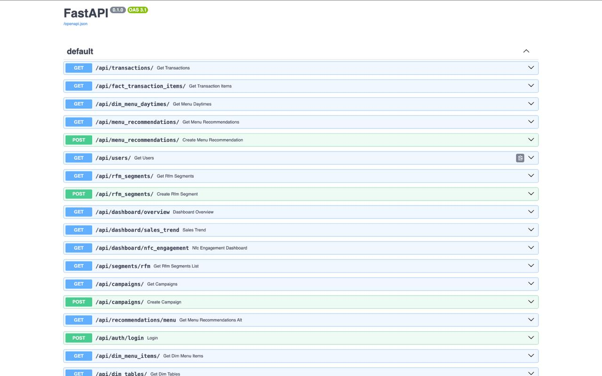
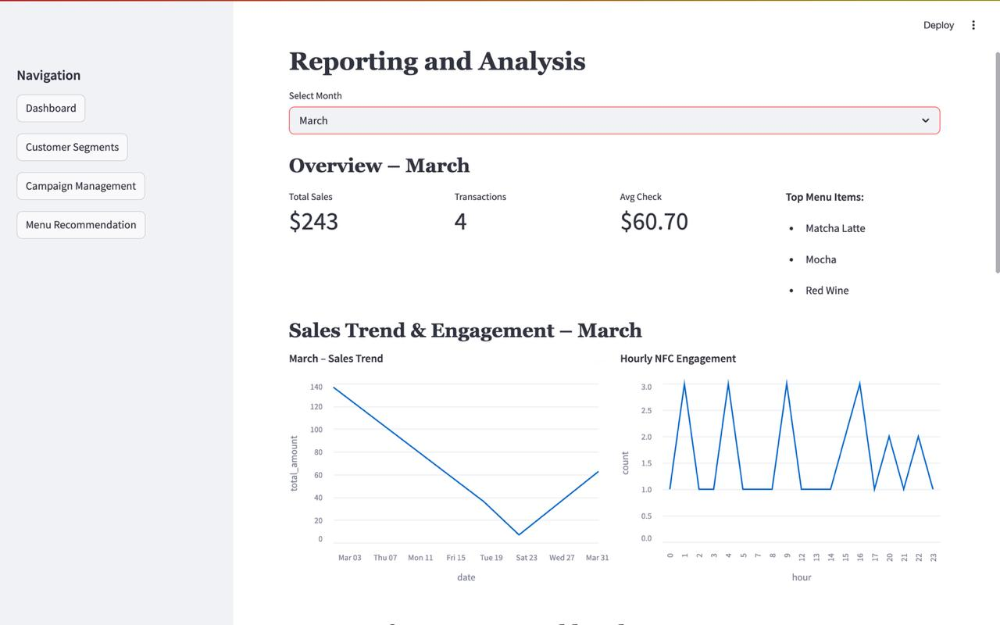

# 📊 SmartCRM: An Analytical CRM System for Restaurants and Cafes in Armenia

SmartCRM is a next-generation analytical CRM platform designed specifically for restaurants and cafes in Armenia. The system focuses on customer retention, behavior analysis, and AI-driven personalization using data collected from NFC chips and POS systems.

Unlike traditional CRMs that focus on operations, SmartCRM provides intelligent insights to help restaurants make data-informed decisions, improve loyalty, and increase revenue.

---

## 📚 Documentation

📄 Hosted on **GitHub Pages**: [SmartCRM Docs](https://ds-223.github.io/Group-2/)

📦 Key sections:
- [API Service](docs/api.md)
- [ETL Process](docs/etl.md)
- [Frontend App](docs/frontend.md)
- [Recommendation & Segmentation](docs/ds.md)
- [Database Schema](docs/database.md)

---

### 🎨 Frontend Prototype

Check out our interactive UI design on **Figma**:  
[🔗 View Figma Design](https://www.figma.com/design/gqCNSPu1h9mv7ZdZHixP1n/Untitled?node-id=0-1&t=TzPQFIS8f6frigWg-1)

---

## 🖼️ Screenshots

### 🔹 Swagger UI


### 🔹 Streamlit UI


---

## 🚀 Features

- NFC-based data collection (Wi-Fi access, digital menu, and review engagement)
- POS integration for transaction and customer behavior data
- RFM segmentation and customer profiling
- Churn prediction and customer clustering
- Menu recommendation engine for waiters
- Loyalty scoring and campaign targeting
- Dashboards with actionable insights

---

## 🧠 Technologies Used

- **FastAPI** – Backend/API development  
- **Python** – Data processing and modeling  
- **Pandas, Scikit-learn** – ML and analytics  
- **PostgreSQL** – Database  
- **Streamlit / Figma** – UI prototype  
- **Git & GitHub Projects** – Version control and task tracking  

---

## 🧩 Project Structure

```
.
├── docs/
│   ├── index.md
│   ├── api.md
│   ├── etl.md
│   ├── frontend.md
│   ├── ds.md
│   ├── database.md
│   ├── notebook.md
│   ├── architecture.md
│   └── assets/
│       ├── swagger.jpg
│       └── ui.jpg
├── feedback/
│   ├── Milestone 1 Feedback.pdf
│   ├── Milestone 2 Feedback.pdf
│   └── Milestone 3 Feedback.pdf
├── myapp/
│   ├── api/
│   │   ├── __init__.py
│   │   ├── crud.py
│   │   ├── data_access.py
│   │   ├── database.py
│   │   ├── main.py
│   │   ├── models.py
│   │   ├── schemas.py
│   │   ├── requirements.txt
│   │   └── Dockerfile
│   ├── etl/
│   │   ├── __init__.py
│   │   ├── data_generator.py
│   │   ├── etl_process.py
│   │   ├── requirements.txt
│   │   └── Dockerfile
│   ├── frontend/
│   │   ├── app.py
│   │   ├── requirements.txt
│   │   └── Dockerfile
│   └── notebook/
│       ├── result_analyses.ipynb
│       ├── requirements.txt
│       └── Dockerfile
├── .github/
│   └── workflows/
│       └── ci.yaml
├── .gitignore
├── docker-compose.yml
├── mkdocs.yml
├── mkdocs_requirements.txt
├── erd.png
├── Roadmap Group-2.pdf
├── Problem Definition – Marketing Analytics Project.pdf
└── README.md
```

---

## 🔧 Setup Instructions

```bash
# Clone the repository
git clone https://github.com/DS-223/Group-2.git
cd Group-2

# Create and activate virtual environment
python -m venv venv
source venv/bin/activate

# Install dependencies
pip install -r mkdocs_requirements.txt

# Run Docs
mkdocs serve
```

Or run the full system using Docker:

```bash
docker-compose up --build
```

---

## 👥 Team Roles

- **Project/Product Manager:** Davit Sargsyan  
- **Data Scientist:** Mane Koshkaryan  
- **Backend Developer:** Armen Madoyan  
- **Frontend Developer:** Sona Stepanyan  
- **Database Developer:** Anna Minasyan 

---

## 📅 Milestones

- **Milestone 1:** Problem definition, roadmap, GitHub setup, UI prototype  
- **Milestone 2:** Database & model development, backend implementation  
- **Milestone 3:** Model integration, final dashboard, deployment  

---

## 📄 License

This project is for academic purposes under DS 223 Marketing Analytics, AUA.  
All rights reserved © 2025.